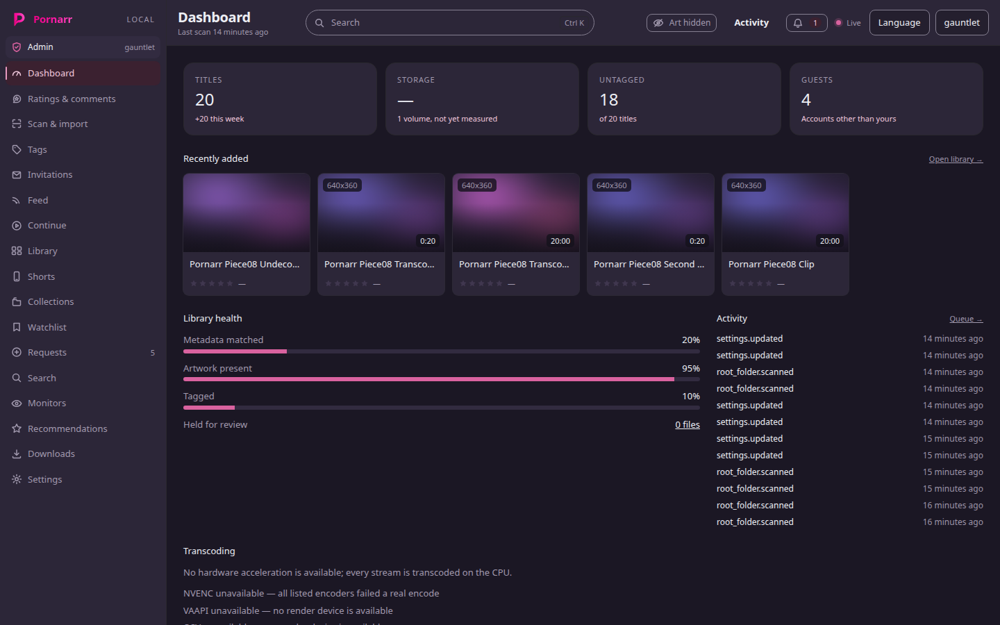
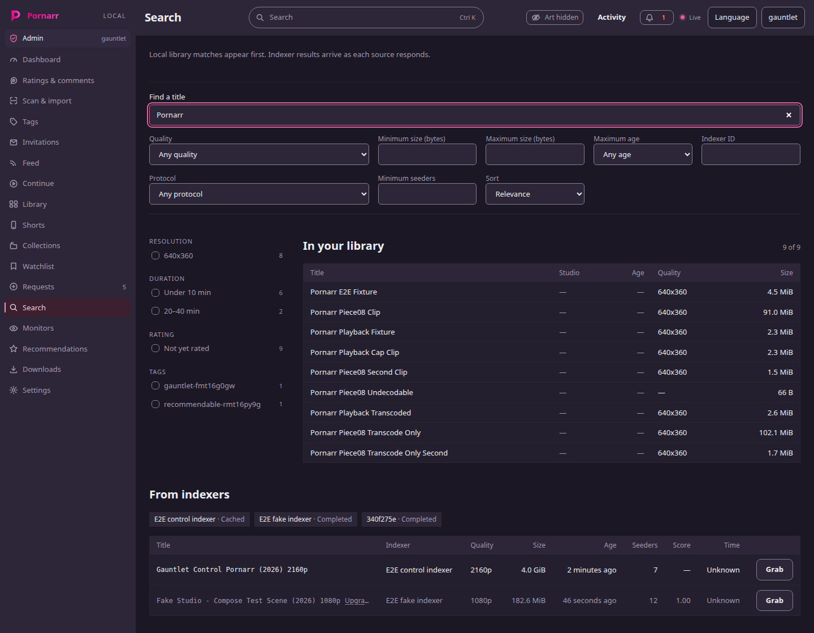
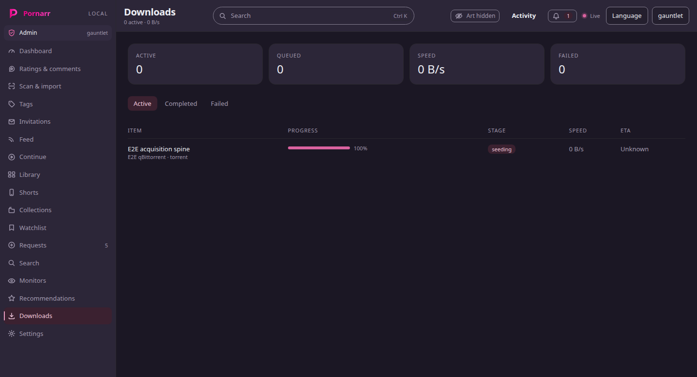
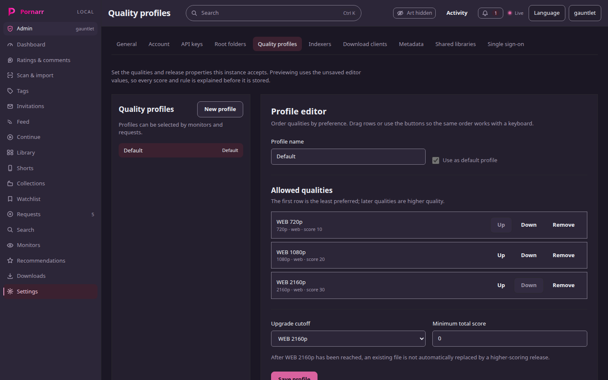
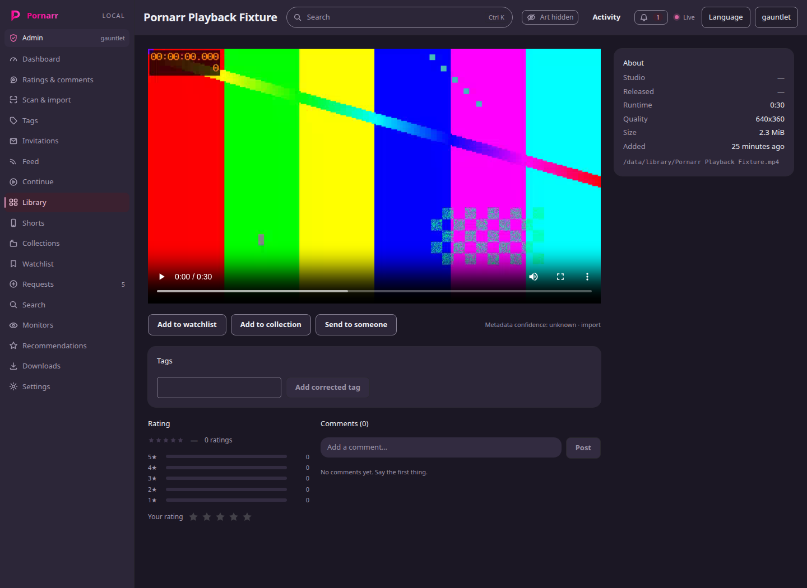
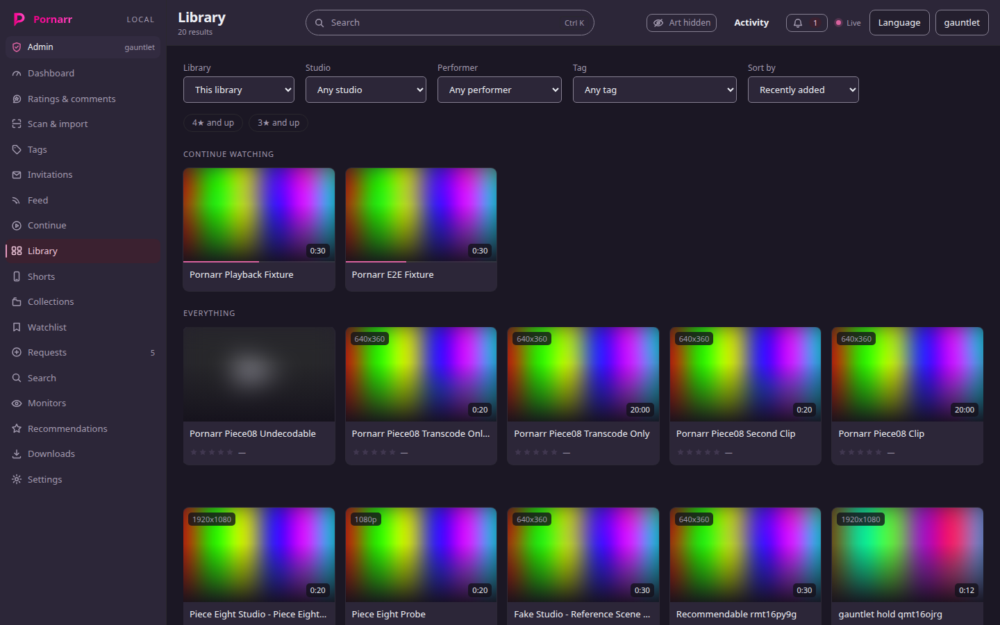

<div align="center">


**Self-hosted, multi-user adult media platform.** One search across your library and your
indexers, releases handed to your download client, imports categorised into your library,
playback in the browser, and per-user recommendations that state their reason.

</div>

---

> **Status: feature-complete, unreleased.** Every feature milestone from
> [v0.1 Foundation](https://github.com/FutureMan0/Pornarr/milestone/1) through
> [v0.9 Recommendations](https://github.com/FutureMan0/Pornarr/milestone/9) has its work
> closed — only the epic that tracks each one is still open — and the whole product has been
> driven end to end through a browser against a real Compose stack: real qBittorrent, real
> SABnzbd, real Torznab and Newznab indexers, real FFmpeg. There is no tagged release and no
> published image yet, so run it from a checkout. What is left is in
> [v1.0 Automation and release](https://github.com/FutureMan0/Pornarr/milestone/10): the
> release itself, and load-testing baselines.



## What works

Each heading below is covered by end-to-end tests that drive the browser against the real
stack, not by mocks. The counts are in [Verification](#verification).

### One search, library and indexers together

Local hits answer immediately and each indexer fills in as it responds, with its own status
shown. Local search is fuzzy rather than a substring match, facet counts are the number of rows
they actually yield, and a release the library already holds is dimmed and badged rather than
hidden. Torznab and Newznab are both first-class, so Prowlarr is optional; a usenet row simply
has no seeder column. Results are cached per query, a malformed indexer response is counted and
eventually skipped, and a rejected API key opens the circuit breaker at once and is named as an
authentication failure rather than a generic one. Size and time estimates arrive as a range with
a confidence, and an unknown says unknown.



### Acquisition and the queue

qBittorrent and SABnzbd, several instances per protocol, routed by priority and then by health.
Grabbing something the client already has is recognised as the same job rather than an error.
Pause, resume, re-prioritise and cancel reach the download client itself. The queue reports the
client's own figures, the summary counts the whole queue rather than the page that loaded, and a
queue estimate is the sum of the jobs that run before it. A download client that cannot be
reached is a named refusal with a next step, and a failed connection test is remembered on the
client row instead of being rolled back. State changes and progress arrive over SSE.



### Import

A completed download is hardlinked into the documented layout — usenet downloads are moved
instead — probed, matched, filtered and announced. Running it twice on the same file changes
nothing, a byte-identical file at another path is turned away as a duplicate, and a fuzzy match
on title, studio, date and duration becomes an upgrade candidate rather than a second library
item. An upgrade replaces the file and keeps the media id, its tags and its history. Files that
are unknown, incomplete or undersized are rejected with a stated reason, and anything FFprobe
cannot read is quarantined for review rather than placed. Every firing filter rule is written to
the audit log. Import also produces the hover sprite and its VTT index. Three downloads finishing
at once all import, with no coordination between them.

### Quality profiles, custom formats and upgrades

Ordered qualities with an upgrade cutoff and a minimum total score, plus custom formats whose
conditions add or subtract score. Previewing a change uses the unsaved editor values, so every
score and rule is explained before it is stored.



### Library, playback and transcoding

Scanned files are probed off the scan's critical path, so titles adopted from an existing disk
carry their codecs, duration and resolution. Playback direct-plays when the browser can decode
the file — the decision compares container, both codecs, the profile and the level — and falls
back to HLS transcoding when it cannot, with hardware acceleration used where the host has it.
Byte-range streaming serves whole files, single ranges, suffix ranges and multipart, and refuses
an unsatisfiable range with 416 and the file's size. Transcode sessions are owner-scoped, expire
on a 60-second TTL that the player's 15-second heartbeat renews, and cannot be made to serve a
segment outside their own directory. The software session cap is CPU cores divided by two unless
an administrator overrides it, a saturated stack refuses with a code and a named limit rather
than an FFmpeg error, and an administrator can see who is transcoding and end a session.



### Everything around the library

Collections, a watchlist, continue-watching with the position it stopped at, a tag vocabulary
that filters the library, shorts with clips made on demand, sending a title to another member,
and per-user recommendations each carrying a stated reason. Artwork is blurred by default and is
lifted from the top bar, per device rather than per account, on the theory that the same person
wants it hidden on the laptop in a shared office and shown on the machine at home — every
screenshot on this page was taken in that default state.



### Requests, monitors and bounded automation

Members request titles and follow them from search to library through an explicit lifecycle —
searching, results found, queued, downloading, processing, available — with per-user concurrency
caps. Monitors on a performer, a studio or a saved query poll RSS and convert only conservative
matches into automatic requests, subject to the same quality profile and filter rules.

### Multi-user, and administration

Local accounts, invitations that can expire or be withdrawn, per-user API keys shown once, and
OIDC sign-in with a button per enabled provider. Every user gets their own profile, content
filters, requests and recommendations; a guest is never offered the administrator's screens.
Administrators get the dashboard, quarantine review, scan and import, tags, invitations, members,
comment moderation, and settings for root folders, quality, indexers, download clients, metadata
providers, shared libraries and single sign-on.

### Things that are load-bearing rather than features

Every function is reachable by keyboard, dialogs hold focus and hand it back, meaning never rides
on colour alone, and each screen has one heading that names it. The interface ships in English
and German, with a test that fails on a hardcoded string, so switching language moves every
string rather than most of them. Reduced motion collapses every duration and distance. Errors
arrive as a code and a context and are rendered with a cause and a next step. Provider
credentials are stored as ciphertext, and the server refuses to start against a database written
with a different `APP_SECRET`.

## Verification

Run against a live Compose stack with real clients and indexers:

| Suite | Result |
|---|---|
| End to end (Playwright, real stack) | 269 passed, 0 failed, 7 skipped |
| Python | 1196 passed, 0 xfailed |
| Integration, against real clients | 33 passed |
| Web | 618 passed |
| ruff, ruff format, ty, biome, tsc | green |

The seven skips are the first-run wizard, which an instance only has once; they are proven
separately against a virgin stack.

## Running it

Docker with the Compose plugin, one filesystem shared by downloads and library, and optionally a
GPU for transcoding. There is no published image yet, so build from a checkout:

```sh
make up      # writes .env with a generated APP_SECRET, then starts the stack
```

Then open the web client and complete the first-run wizard: administrator account, library path,
and optionally an indexer and a download client, both of which are tested against the real
service before they are accepted.

The [installation guide](docs/operations/installation.md) covers the one-mount rule, GPU
passthrough, reverse proxies, upgrades, and the failures people actually hit. `make help` lists
the rest of the targets.

## Documentation

[docs/](docs/) — architecture, data model, API contract, integrations, pipelines, operations,
and every architecture decision as a numbered ADR.

## Legal

Pornarr does not host, index or distribute content. It is a client for infrastructure you
already run, and it is for legally available material only. Content filtering is configured by
you; nothing is filtered by default.

## Licence

MIT. See [LICENSE](LICENSE).
